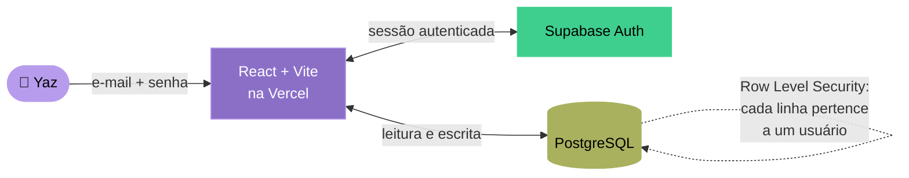

# Hub pessoal

**Um web app privado que reúne finanças, estudos, trabalho e bem-estar em um só lugar.**

*Repositório de vitrine. O código-fonte e o site rodam em ambiente privado por conterem dados pessoais.*

 

---

## ✨ Visão geral

Cinco áreas da vida costumam morar em cinco apps diferentes. Este projeto junta tudo numa ferramenta única, feita sob medida, fechada por autenticação e com os dados protegidos no nível do banco.

| Área | O que faz |
| --- | --- |
| 💰 **Finanças** | Entradas e saídas do mês por categoria, com saldo automático, e planejamento de objetivos de investimento com barras de progresso e registro de aportes |
| 🏗️ **Ape** | Acompanhamento da evolução da obra e do cronograma completo de parcelas da entrada, com cálculo automático da correção paga (previsto × real) |
| 📚 **Estudos** | Cursos e MBA organizados em matérias, cada uma com anotações datadas e links de referência que exibem prévia automática de imagens e vídeos |
| 💼 **Trabalho** | Tarefas por produto com fluxo de status (a fazer / fazendo / feito), anotações de reuniões e biblioteca de links úteis |
| 🫶 **Sentimentos** | Diário de humor com escala visual e texto livre |

 

---

## 🏛️ Arquitetura

O front-end nunca toca no banco diretamente sem passar pela sessão autenticada, e as regras de acesso vivem no próprio banco, não no código do cliente.

Cada área do hub é persistida como um documento JSON por seção, ligado ao `user_id`. Esse formato deixa a evolução de funcionalidades barata: adicionar um campo novo não exige migração de schema.

---

## 🔐 Decisões de segurança

- **Privacidade por arquitetura.** Políticas de Row Level Security garantem, no nível do PostgreSQL, que cada linha só é lida ou escrita pela dona da conta (`auth.uid() = user_id`). Mesmo com a URL e a chave pública do projeto, sem a sessão correta o banco não devolve nada.
- **Conta única, portas fechadas.** O cadastro público de novos usuários fica desativado no painel de autenticação; existe uma só conta, criada manualmente.
- **Segredos fora do repositório.** Credenciais vivem em variáveis de ambiente (local e na plataforma de deploy), nunca versionadas. A separação entre chave pública e chave secreta é respeitada: a secreta jamais chega ao front-end.
- **Não indexável.** A página pede aos buscadores para não indexá-la, então não aparece em pesquisas.

---

## 🧩 Destaques de implementação

- **Cronograma financeiro com correção.** O módulo do apê gera todas as parcelas mês a mês até a data de entrega e, a cada pagamento, compara o valor real do boleto com o previsto para revelar quanto já foi pago em correção monetária durante a obra.
- **Prévia inteligente de links.** Um mesmo campo aceita qualquer URL e decide sozinho como renderizar: miniatura para imagens, thumbnail clicável para vídeos do YouTube, ou cartão de atalho para os demais.
- **UX otimista.** A interface responde na hora e persiste em segundo plano, exibindo um aviso discreto caso a gravação falhe, para nunca travar o uso esperando a rede.
- **Migração de dados tolerante.** Uma camada de normalização preenche campos novos em registros antigos, então atualizações de funcionalidade não quebram dados já salvos.
- **Design system próprio.** Tokens centralizados de cor e tipografia (paleta roxo + verde oliva + lilás; Bricolage Grotesque, Instrument Sans e JetBrains Mono) garantem consistência e trocas de tema em um único ponto.

---

## 🛠️ Stack

| Camada | Tecnologia |
| --- | --- |
| Front-end | React + Vite |
| Autenticação | Supabase Auth (cadastros desativados, usuária única) |
| Banco de dados | Supabase (PostgreSQL) com Row Level Security |
| Hospedagem & CI | Vercel (deploy contínuo a cada push) |
| Design | Design tokens próprios · Bricolage Grotesque · Instrument Sans · JetBrains Mono |

---

## 🌱 Próximos passos

- [ ] Gráfico de evolução do humor ao longo do tempo
- [ ] Exportação de dados (backup em CSV/JSON) pela própria interface
- [ ] Formatação rica nas anotações (negrito, listas, títulos)
- [ ] Lembretes de vencimento da parcela do apê
- [ ] Visão anual consolidada das finanças

---

## 💡 Por que esse projeto existe

Nasceu da vontade de juntar planejamento financeiro, o acompanhamento de um apê comprado na planta, estudos de produto e IA, trabalho e bem-estar numa ferramenta única, do meu jeito, em vez de espalhar a vida em cinco apps diferentes.

Como Product Owner, foi também meu laboratório para colocar a mão na massa de ponta a ponta: modelar dados, desenhar autenticação e segurança de acesso, e configurar deploy contínuo. Construir a coisa inteira afia a intuição de produto sobre o que é fácil, o que é caro e onde moram os riscos.

---

*Feito com muito 💜*

